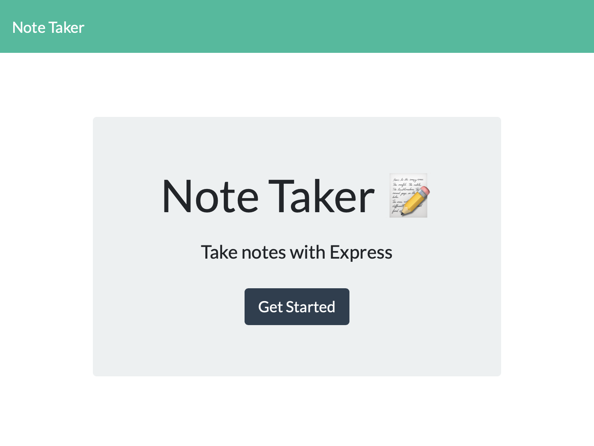
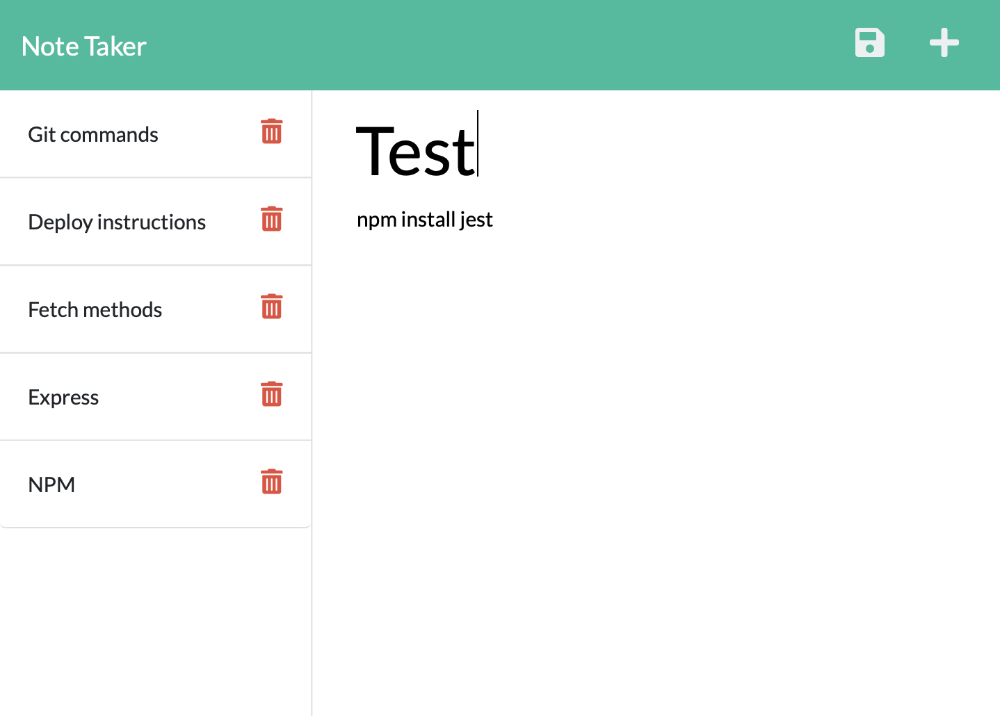

# Note Taker

Github repository link: https://github.com/avpizarro/noteTaker.git

App URL: https://glacial-refuge-08027.herokuapp.com/

  ## Description
 
  Use this app built with Express to write and save notes.

  

  

  ## Table of Contents

  * [Installation](#installation)
  * [Usage](#usage)
  * [Questions](#questions)

  ## Installation
  This app was deployed to Heroku and is accesible :link: [here](https://glacial-refuge-08027.herokuapp.com)

  ## Usage
  Click on the 'Get Started' button on the homepage to start adding your notes.
  Enter a title for your note, your note's text and a save button will appear.
  Save your note and add a new one by clicking the + symbol.
  The saved notes display on the left hand side column.
  Click the trashcan icon to delete a note.

  ## Questions
  For further information please visit my GitHub page:
  https://github.com/avpizarro
  